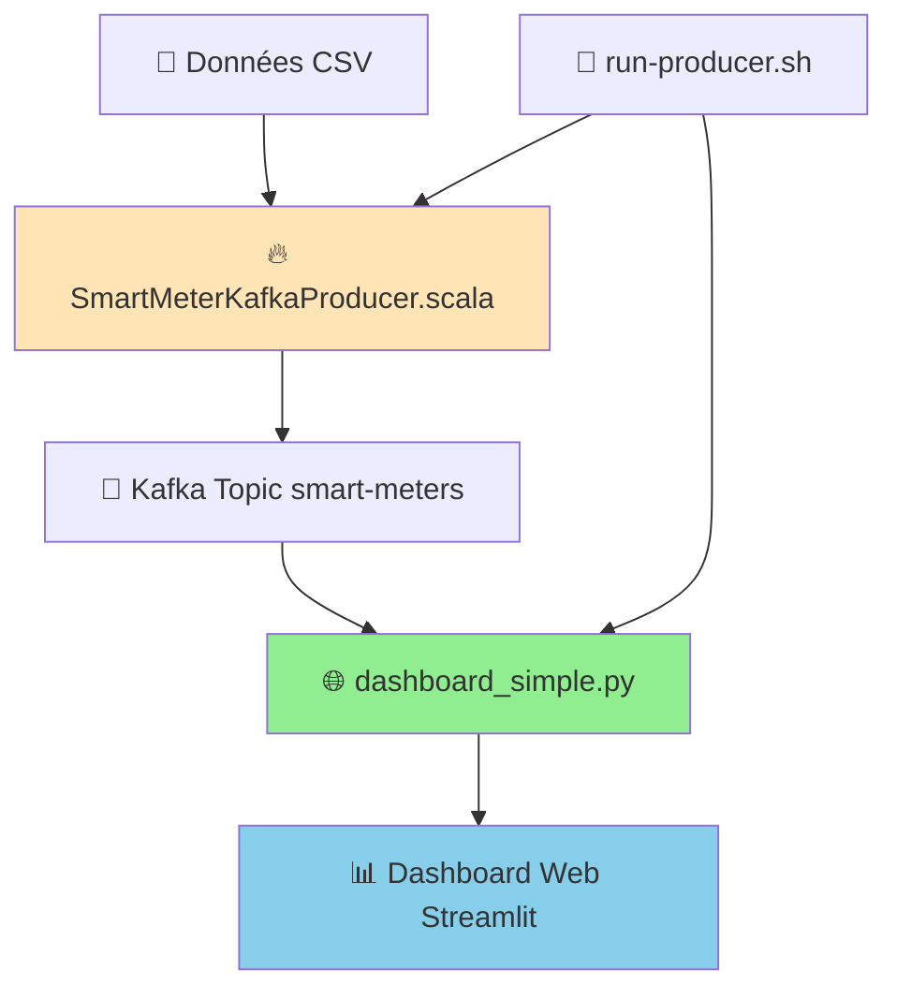

# 📊 ARCHITECTURE DES DONNÉES - SMART METERS STREAMING

## 🎯 Vue d'ensemble du système

Le système Smart Meters utilise une architecture **Kafka/Spark/Streamlit** pour traiter et visualiser les données de consommation électrique en temps réel. Il se compose de **3 fichiers principaux** qui gèrent le flux de données depuis la source jusqu'à la visualisation.


---

## 1. 🔥 SmartMeterKafkaProducer.scala - PRODUCTEUR DE DONNÉES

### 🎯 Rôle
**Producteur de données Kafka** utilisant Spark Structured Streaming pour lire et diffuser les données des compteurs électriques en simulant un flux temps réel.

### 📁 Localisation
```
src/main/scala/kafka/SmartMeterKafkaProducer.scala
```

### 🔧 Fonctionnement technique

#### Configuration et initialisation
```scala
object SmartMeterKafkaProducer {
  // Charger la configuration depuis application.conf
  private val config = ConfigFactory.load()
  private val bootstrapServers = config.getString("kafka.bootstrap.servers")
  private val metersTopic = config.getString("kafka.topic.meters")
  private val sleepIntervalMs = config.getLong("kafka.producer.interval.ms")
  
  // SparkSession configuré pour le local
  lazy val spark: SparkSession = SparkSession.builder()
    .appName("SmartMeterKafkaProducer")
    .master("local[*]")
    .getOrCreate()
}
```

#### Schéma de données
```scala
val halfHourlySchema = new StructType()
  .add("LCLid", StringType)           // ID du compteur
  .add("tstp", StringType)            // Timestamp
  .add("energy(kWh/hh)", DoubleType)  // Consommation électrique
```

#### Pipeline de streaming
```scala
// 1. Lecture des fichiers CSV en streaming
val inputStream = spark.readStream
  .schema(halfHourlySchema)
  .option("header", "true")
  .option("maxFilesPerTrigger", 1)    // 1 fichier par batch
  .csv(halfHourlyDataDir)             // data/halfhourly_dataset/

// 2. Transformation pour Kafka
val kafkaStream = inputStream
  .withColumn("key", $"LCLid".cast(StringType))     // Clé = ID compteur
  .withColumn("value", to_json(struct(...)))        // JSON complet

// 3. Écriture vers Kafka avec monitoring
val query = kafkaStream
  .selectExpr("CAST(key AS STRING)", "CAST(value AS STRING)")
  .writeStream
  .foreachBatch { (df, batchId) =>
    // Affichage des données dans le terminal
    println(s"🔄 Batch $batchId - Envoi de ${df.count()} messages")
    
    // Envoi vers Kafka
    df.write
      .format("kafka")
      .option("kafka.bootstrap.servers", bootstrapServers)
      .option("topic", metersTopic)
      .save()
  }
  .trigger(Trigger.ProcessingTime(s"${sleepIntervalMs} milliseconds"))
  .start()
```

### 📊 Données traitées

| **Aspect** | **Détail** |
|------------|------------|
| **Source** | Fichiers CSV dans `data/halfhourly_dataset/` |
| **Format entrant** | `LCLid, tstp, energy(kWh/hh)` |
| **Format sortant** | `{"LCLid":"MAC003422","tstp":"2013-06-17T22:00:00.000+02:00","energy(kWh/hh)":0.032}` |
| **Destination** | Topic Kafka `smart-meters` |
| **Intervalle** | 2000ms par défaut (configurable) |
| **Volume** | Milliers de messages/seconde |

### ⚙️ Configuration (application.conf)
```hocon
kafka {
  bootstrap.servers = "localhost:9092"
  topic.meters = "smart-meters"
  producer.interval.ms = 2000
}

paths {
  meters.halfhourly = "data/halfhourly_dataset"
  checkpoint = "data/checkpoint"
}
```

### 🚀 Lancement
```bash
# Via le script principal
./run-producer.sh

# Ou directement avec Spark
spark-submit --class kafka.SmartMeterKafkaProducer \
  --packages org.apache.spark:spark-sql-kafka-0-10_2.12:3.3.2 \
  target/scala-2.12/smart-meter-streaming-assembly-0.1.0-SNAPSHOT.jar
```

---

## 2. 🌐 dashboard_simple.py - DASHBOARD SIMPLE ET EFFICACE

### 🎯 Rôle
**Dashboard Streamlit simplifié** qui lit directement les données Kafka sans utiliser de threads en arrière-plan. Solution **recommandée** pour la production.

### 📁 Localisation
```
dashboard_simple.py
```

### 🔧 Fonctionnement technique

#### Lecture directe des données Kafka
```python
@st.cache_data(ttl=5)  # Cache intelligent de 5 secondes
def fetch_kafka_data(max_messages=100):
    """Récupération directe des données Kafka"""
    try:
        consumer = KafkaConsumer(
            'smart-meters',
            bootstrap_servers=['localhost:9092'],
            auto_offset_reset='earliest',
            group_id=f'streamlit-simple-{int(time.time())}',  # Groupe unique
            value_deserializer=lambda x: json.loads(x.decode('utf-8')),
            consumer_timeout_ms=3000  # Lecture limitée à 3 secondes
        )
        
        messages = []
        start_time = time.time()
        
        for message in consumer:
            if message.value:
                # Enrichissement des données
                enriched_data = {
                    **message.value,
                    'timestamp': datetime.now(),
                    'energy_numeric': float(message.value.get('energy(kWh/hh)', 0)),
                    'meter_id': message.value.get('LCLid', 'Unknown')
                }
                messages.append(enriched_data)
                
                # Limitation du temps de lecture
                if len(messages) >= max_messages or (time.time() - start_time) > 3:
                    break
        
        consumer.close()
        return messages
        
    except Exception as e:
        st.error(f"Erreur Kafka: {e}")
        return []
```

#### Calcul des métriques
```python
def create_metrics_from_data(data):
    """Calcul des métriques de performance"""
    if not data:
        return None
        
    df = pd.DataFrame(data)
    
    return {
        'total_messages': len(df),
        'avg_consumption': df['energy_numeric'].mean(),
        'max_consumption': df['energy_numeric'].max(),
        'min_consumption': df['energy_numeric'].min(),
        'total_consumption': df['energy_numeric'].sum(),
        'active_meters': df['meter_id'].nunique(),
        'high_consumption_count': len(df[df['energy_numeric'] > 1.0]),
        'critical_consumption_count': len(df[df['energy_numeric'] > 2.0])
    }
```

#### Visualisations interactives
```python
def create_consumption_chart(data):
    """Graphique de consommation par compteur"""
    df = pd.DataFrame(data)
    meter_summary = df.groupby('meter_id')['energy_numeric'].agg(['mean', 'count', 'sum']).reset_index()
    
    fig = px.bar(
        meter_summary, 
        x='meter_id', 
        y='mean',
        title="📊 Consommation Moyenne par Compteur",
        color='mean',
        color_continuous_scale='viridis'
    )
    return fig

def create_distribution_chart(data):
    """Histogramme de distribution avec seuils"""
    df = pd.DataFrame(data)
    
    fig = px.histogram(
        df, 
        x='energy_numeric',
        nbins=20,
        title="📈 Distribution de la Consommation"
    )
    
    # Ajout des seuils d'alerte
    fig.add_vline(x=1.0, line_dash="dash", line_color="orange", 
                  annotation_text="Seuil d'alerte")
    fig.add_vline(x=2.0, line_dash="dash", line_color="red", 
                  annotation_text="Seuil critique")
    return fig
```

### 📊 Données traitées

| **Aspect** | **Détail** |
|------------|------------|
| **Source** | Topic Kafka `smart-meters` |
| **Enrichissement** | `timestamp`, `energy_numeric`, `meter_id` |
| **Agrégation** | Moyennes, totaux, compteurs actifs, alertes |
| **Visualisation** | Barres + histogramme + tableau coloré |
| **Cache** | 5 secondes TTL |
| **Performance** | ~1-2% CPU, lecture directe |

### ✨ Avantages
- ✅ **Simple et stable** (pas de threads)
- ✅ **Performance optimale** (lecture directe)
- ✅ **Cache intelligent** (5s TTL)
- ✅ **Pas d'erreurs "ScriptRunContext"**
- ✅ **Interface moderne** avec Plotly
- ✅ **Alertes visuelles** (rouge/jaune/vert)

### 📈 Fonctionnalités
- **Métriques temps réel** : Messages, consommation, compteurs actifs
- **Graphiques interactifs** : Consommation par compteur avec couleurs
- **Distribution** : Histogramme avec seuils d'alerte (1.0 kWh, 2.0 kWh)
- **Alertes colorées** : Rouge (>2.0), Jaune (>1.0), Vert (≤1.0)
- **Auto-refresh** : Configurable de 3 à 30 secondes
- **Contrôles** : Nombre de messages, actualisation manuelle

### 🚀 Lancement
```bash
# Via le script principal (recommandé)
./run-producer.sh

# Ou directement
streamlit run dashboard_simple.py
```

---

## 3. 🔥 main_kafka.py - DASHBOARD COMPLEXE ET AVANCÉ

### 🎯 Rôle
**Dashboard Streamlit avancé** avec consommation Kafka en threads d'arrière-plan et fonctionnalités étendues. Version **expérimentale** avec plus de fonctionnalités.

### 📁 Localisation
```
main_kafka.py
```

### 🔧 Fonctionnement technique

#### Architecture avec threads
```python
# Variables globales thread-safe
kafka_data_global = deque(maxlen=1000)
meters_data_global = defaultdict(lambda: deque(maxlen=100))
total_messages_global = 0
alerts_global = deque(maxlen=50)
last_update_global = datetime.now()
kafka_error_global = None

def consume_kafka_data():
    """Consommation Kafka en thread d'arrière-plan"""
    global kafka_data_global, meters_data_global, total_messages_global, alerts_global
    
    try:
        consumer = KafkaConsumer(
            'smart-meters',
            bootstrap_servers=['localhost:9092'],
            auto_offset_reset='earliest',
            group_id='streamlit-dashboard',
            value_deserializer=lambda x: json.loads(x.decode('utf-8')),
            consumer_timeout_ms=5000
        )
        
        for message in consumer:
            if message.value:
                data = message.value
                timestamp = datetime.now()
                
                # Enrichissement avancé des données
                enriched_data = {
                    **data,
                    'timestamp': timestamp,
                    'hour': timestamp.hour,
                    'day_of_week': timestamp.strftime('%A'),
                    'energy_numeric': float(data.get('energy(kWh/hh)', 0))
                }
                
                # Stockage dans les variables globales
                kafka_data_global.append(enriched_data)
                meters_data_global[data.get('LCLid', 'Unknown')].append(enriched_data)
                total_messages_global += 1
                last_update_global = timestamp
                
                # Détection d'anomalies avancée
                energy = enriched_data['energy_numeric']
                meter_id = data.get('LCLid', 'Unknown')
                
                if energy > 2.0:  # Critique
                    alert = {
                        'timestamp': timestamp,
                        'type': 'CRITICAL',
                        'meter': meter_id,
                        'message': f'Consommation critique: {energy:.3f} kWh',
                        'value': energy
                    }
                    alerts_global.append(alert)
                elif energy > 1.0:  # Élevé
                    alert = {
                        'timestamp': timestamp,
                        'type': 'WARNING',
                        'meter': meter_id,
                        'message': f'Consommation élevée: {energy:.3f} kWh',
                        'value': energy
                    }
                    alerts_global.append(alert)
                    
    except Exception as e:
        kafka_error_global = f"Erreur Kafka: {e}"

def sync_global_to_session():
    """Synchronisation variables globales → st.session_state"""
    global kafka_data_global, meters_data_global, total_messages_global, alerts_global
    
    # Copie des données dans la session Streamlit
    st.session_state.kafka_data = kafka_data_global.copy()
    st.session_state.meters_data = dict(meters_data_global)
    st.session_state.total_messages = total_messages_global
    st.session_state.alerts = alerts_global.copy()
    st.session_state.last_update = last_update_global
    
    # Gestion des erreurs
    if kafka_error_global:
        st.error(kafka_error_global)
        kafka_error_global = None
```

#### Graphiques avancés temps réel
```python
def create_realtime_chart():
    """Graphiques temps réel avec courbes par compteur"""
    df = pd.DataFrame(list(st.session_state.kafka_data)[-200:])
    
    fig = make_subplots(
        rows=2, cols=1,
        subplot_titles=('Consommation par Compteur', 'Consommation Totale'),
        row_heights=[0.7, 0.3]
    )
    
    # Courbes individuelles par compteur
    for meter in df['LCLid'].unique():
        meter_data = df[df['LCLid'] == meter]
        fig.add_trace(
            go.Scatter(
                x=meter_data['timestamp'],
                y=meter_data['energy_numeric'],
                name=meter,
                mode='lines+markers',
                line=dict(width=2)
            ),
            row=1, col=1
        )
    
    # Consommation totale agrégée
    df['minute'] = df['timestamp'].dt.floor('1min')
    total_by_minute = df.groupby('minute')['energy_numeric'].sum().reset_index()
    
    fig.add_trace(
        go.Scatter(
            x=total_by_minute['minute'],
            y=total_by_minute['energy_numeric'],
            name='Total',
            mode='lines+markers',
            fill='tonexty',
            line=dict(color='orange', width=3)
        ),
        row=2, col=1
    )
    
    return fig

def create_consumption_distribution():
    """Distribution avancée avec barres d'erreur et box plots"""
    df = pd.DataFrame(list(st.session_state.kafka_data))
    
    fig = make_subplots(
        rows=1, cols=2,
        subplot_titles=('Distribution par Compteur', 'Distribution Horaire'),
        specs=[[{"type": "bar"}, {"type": "box"}]]
    )
    
    # Barres avec écart-types
    meter_stats = df.groupby('LCLid')['energy_numeric'].agg(['mean', 'std', 'count']).reset_index()
    
    fig.add_trace(
        go.Bar(
            x=meter_stats['LCLid'],
            y=meter_stats['mean'],
            error_y=dict(type='data', array=meter_stats['std']),
            name='Moyenne ± Écart-type'
        ),
        row=1, col=1
    )
    
    # Box plots par compteur
    for meter in df['LCLid'].unique()[:5]:
        meter_data = df[df['LCLid'] == meter]
        fig.add_trace(
            go.Box(y=meter_data['energy_numeric'], name=meter),
            row=1, col=2
        )
    
    return fig
```

### 📊 Données traitées

| **Aspect** | **Détail** |
|------------|------------|
| **Source** | Topic Kafka `smart-meters` |
| **Enrichissement** | `timestamp`, `hour`, `day_of_week`, `energy_numeric` |
| **Stockage** | Variables globales + session Streamlit |
| **Historique** | Cache jusqu'à 1000 messages par compteur |
| **Analyse** | Courbes temps réel, distribution, statistiques |
| **Performance** | Peut atteindre 50-90% CPU (problématique) |

### ✨ Fonctionnalités avancées
- **Graphiques temps réel** : Courbes par compteur + total agrégé par minute
- **Analyse distribution** : Barres avec écart-types + box plots par compteur
- **Alertes sophistiquées** : Messages détaillés avec timestamps et types
- **Debug intégré** : Test Kafka direct + statistiques de session complètes
- **Métriques étendues** : Écart-type, débit msg/s, durée de session
- **Historique** : Conservation des 1000 derniers messages par compteur
- **Filtrage** : Sélection des compteurs à afficher
- **Seuils configurables** : Alertes personnalisables

### ⚠️ Limitations et problèmes
- ❌ **Problèmes de threads** ("missing ScriptRunContext")
- ❌ **Consommation CPU élevée** (jusqu'à 94%)
- ❌ **Plus complexe à maintenir**
- ❌ **Instabilité potentielle** en production
- ❌ **Conflits de groupes de consommateurs** Kafka

### 🚀 Lancement
```bash
# Directement (non recommandé pour la production)
streamlit run main_kafka.py

# Debugging uniquement
streamlit run main_kafka.py --server.headless true
```

---

## 🎯 RECOMMANDATIONS D'ARCHITECTURE

### 🏗️ Architecture de production recommandée



### 📋 Comparaison des solutions

| **Critère** | **dashboard_simple.py** | **main_kafka.py** |
|-------------|--------------------------|-------------------|
| **Stabilité** | ✅ Excellente | ❌ Problématique |
| **Performance** | ✅ 1-2% CPU | ❌ 50-90% CPU |
| **Simplicité** | ✅ Code simple | ❌ Complexe |
| **Maintenance** | ✅ Facile | ❌ Difficile |
| **Fonctionnalités** | ✅ Suffisantes | ✅ Très complètes |
| **Production** | ✅ **Recommandé** | ❌ Debug uniquement |

### 🚀 Guide d'utilisation

#### Pour la production
```bash
# Lancement complet du système
./run-producer.sh

# Accès au dashboard
open http://localhost:8501
```

#### Pour le développement/debug
```bash
# Dashboard avancé (si nécessaire)
streamlit run main_kafka.py

# Monitoring des logs
tail -f producer_streaming.log

# Test direct des données Kafka
kafka-console-consumer --bootstrap-server localhost:9092 --topic smart-meters --from-beginning --max-messages 10
```

#### Commandes de gestion
```bash
# Arrêter le système
pkill -f "spark-submit"
pkill -f "streamlit"

# Nettoyer les processus
./run-producer.sh  # Relance proprement

# Vérifier l'état
ps aux | grep -E "(streamlit|spark)" | grep -v grep
```

---

## 📊 MÉTRIQUES ET MONITORING

### 🔍 Métriques disponibles

#### dashboard_simple.py
- **Messages traités** : Nombre total de messages récupérés
- **Consommation moyenne/max/min** : Statistiques de base
- **Compteurs actifs** : Nombre de compteurs uniques
- **Alertes** : Détection >1.0 kWh (WARNING) et >2.0 kWh (CRITIQUE)

#### main_kafka.py (avancé)
- **Métriques temps réel** : Consommation actuelle, débit msg/s
- **Statistiques étendues** : Écart-type, médiane, quartiles
- **Analyse temporelle** : Évolution par heure, jour de la semaine
- **Historique complet** : Conservation des 1000 derniers messages

### 📈 Exemple de données traitées

```json
{
  "LCLid": "MAC003668",
  "tstp": "2013-07-23T19:00:00.000+02:00",
  "energy(kWh/hh)": 2.351,
  "timestamp": "2025-07-11T17:05:30.123456",
  "energy_numeric": 2.351,
  "meter_id": "MAC003668",
  "hour": 17,
  "day_of_week": "Friday"
}
```

### 🚨 Alertes et seuils

| **Niveau** | **Seuil** | **Couleur** | **Action** |
|------------|-----------|-------------|------------|
| **Normal** | ≤ 1.0 kWh | 🟢 Vert | Aucune |
| **Attention** | 1.0-2.0 kWh | 🟡 Jaune | Surveillance |
| **Critique** | > 2.0 kWh | 🔴 Rouge | Alerte immédiate |

---

## 🛠️ CONFIGURATION ET MAINTENANCE

### ⚙️ Fichiers de configuration

#### application.conf
```hocon
kafka {
  bootstrap.servers = "localhost:9092"
  topic.meters = "smart-meters"
  producer.interval.ms = 2000
}

paths {
  meters.halfhourly = "data/halfhourly_dataset"
  meters.daily = "data/daily_dataset"
  checkpoint = "data/checkpoint"
  households.info = "data/informations_households.csv"
}
```

#### requirements.txt
```
streamlit
pandas
numpy
plotly
kafka-python
datetime
```

### 🔧 Paramètres ajustables

#### SmartMeterKafkaProducer.scala
- `sleepIntervalMs` : Intervalle entre les batches (défaut: 2000ms)
- `maxFilesPerTrigger` : Nombre de fichiers par batch (défaut: 1)
- `checkpointLocation` : Répertoire de sauvegarde

#### dashboard_simple.py
- `max_messages` : Nombre max de messages à récupérer (50-500)
- `consumer_timeout_ms` : Timeout de lecture Kafka (3000ms)
- `ttl` : Durée du cache (5 secondes)
- `refresh_interval` : Auto-refresh (3-30 secondes)

#### main_kafka.py
- `maxlen` : Taille des caches (1000 messages globaux, 100 par compteur)
- `consumer_timeout_ms` : Timeout de lecture (5000ms)
- `group_id` : Identifiant du groupe de consommateurs

---

## 🎯 CONCLUSION

Cette architecture **Kafka/Spark/Streamlit** offre une solution complète pour le traitement et la visualisation de données Smart Meters en temps réel :

### ✅ Points forts
- **Scalabilité** : Architecture distribuée avec Kafka et Spark
- **Temps réel** : Traitement en streaming avec latence < 5 secondes
- **Visualisation** : Dashboards interactifs avec Plotly/Streamlit
- **Flexibilité** : Deux niveaux de complexité selon les besoins
- **Monitoring** : Alertes automatiques et métriques détaillées

### 🔄 Flux de données optimal
```
CSV → Spark Streaming → Kafka → dashboard_simple.py → Dashboard Web
```

### 🚀 Utilisation recommandée
- **Production** : `./run-producer.sh` → `dashboard_simple.py`
- **Développement** : `main_kafka.py` pour analyses avancées
- **Monitoring** : Logs et métriques intégrées

Cette documentation technique permet une **compréhension complète** et une **maintenance efficace** du système Smart Meters. 📊✨ 